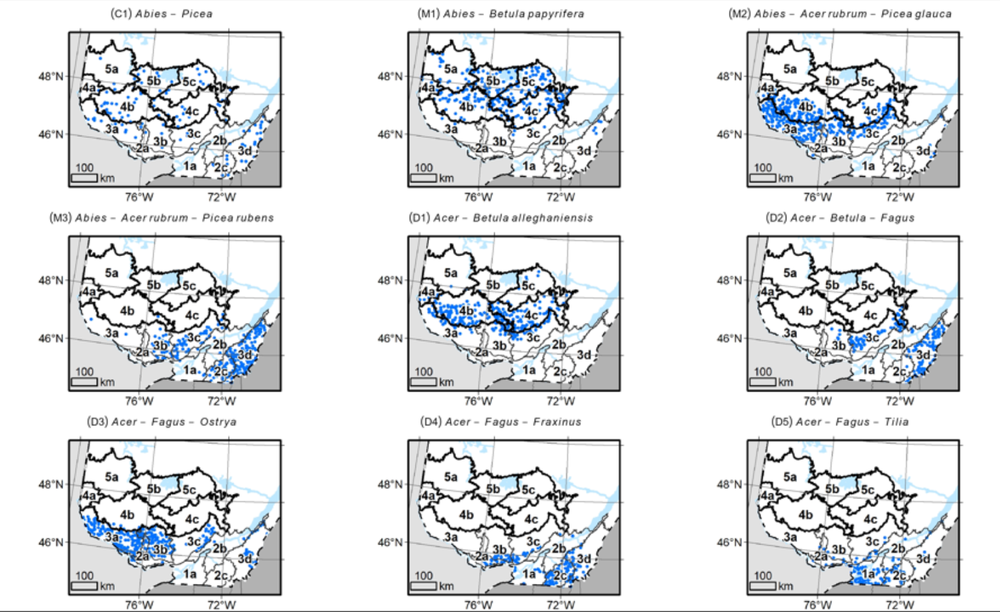

```{r, include = FALSE}
knitr::opts_chunk$set(
  collapse = TRUE,
  comment = "#>"
)
library(classEcoFor)
library(dplyr)
library(mapview)
library(vegan)
library(sf)
```


```{R main, include = FALSE}
res <- chalumeau()
#res <- readRDS("../resources/res_main.rds")
```


# Résumé de l'approche 

L'approche finale retenue dans les travaux d'Aurélie Chalumeau est la suivante:

1. RDA (voir https://r.qcbs.ca/workshop10/book-en/redundancy-analysis.html):
  - transformation d'Hellinger (meilleur R^2^ ajusté) pour les données d'espèces
  - les variables d'environnement retenues sont:
    - l'altitude (`ALTI`);
    - la température (`TMA`);
    - le type d'humus (`mor`, `tourbe`, `mull`, `moder`, considérés comme indépendants dans l'analyse originale);
    - `s_plat` (une des valeurs possible de `SITUATION`);
    - l'épaisseur de l'humus (`HUMEPAI`);
    - les précipitations (`PMA`);
    - la force de la pente (`FORCPENT`);

2. Un K-means (classification non supervisée) utilisant les 10 premiers axes de la RDA, avec une augmentation progressive du nombre de groupes de 2 à 30, les indices utilisés sont:
  - *simple structure index* (ssi),
  - *average silhouette width* (silhouette),
  - *total within sum of square* (wss, aussi Calinkski)
La méthode des coudes est appliquée sur l'indice wss identifie **9** groupes, mais ce sont les groupes basés sur l'indices de ssi qui sont utilisés.

3. C'est groupes sont utilisés comme une nouvelle classification pour explorer les changements futures, par exemple pour comprendre comment les différents groupes vont être affectés par les changements.


# Résultats 

## RDA et Kmeans

```{R plot_rda, fig.width = 8, fig.height = 8, echo = FALSE}
triplot_rda(res$rda)
plot(res$km_ssi)
plot(res$km_cal)
```

## Composition et distribution des 9 groupes obtenus


```{R maps, results = "asis", fig.height = 5, fig.width = 7, warning = FALSE, message = FALSE, echo = FALSE}
nm_var <- names(res$data$full)
nm_var <- nm_var[nchar(nm_var) == 3 & nm_var != "TMA" & nm_var != "PMA"]
nm_var_cle <- c("CLE_ECO", nm_var)

grp_ssi_9 <- res$km_ssi$partition  |>
  as.data.frame()
names(grp_ssi_9) <- paste0("grp_ssi_", 2:30)
grp_ssi_9 <- grp_ssi_9  |>
  mutate(CLE_ECO = res$data$full$CLE_ECO) |>
  select(CLE_ECO, grp_ssi_9)

plot_location_res <- plot_location |>
  filter(CLE_ECO %in% res$data$full$CLE_ECO) |>
  inner_join(grp_ssi_9) |>
  inner_join(res$dat$full |> 
  select(all_of(nm_var_cle)))

plot_grp_stat <- plot_location_res |>
  sf::st_drop_geometry() |>
  group_by(grp_ssi_9) |>
  summarise_at(all_of(nm_var), mean)

plot_location_res_tr <- plot_location_res |>
  sf::st_transform(crs = st_crs(domain_bio))

for (i in 1:9) {
  cat("<h3> Groupe ", i, "</h3>\n\n")
  par(mfrow = c(1, 2), mar = c(4, 4, 1, 1))
  tmp <- plot_grp_stat |>
    dplyr::filter(grp_ssi_9 == i) |>
    select(-grp_ssi_9) |>
    as.vector() |>
    unlist() |>
    sort() |>
    rev()
  plot(tmp[1:12],
    type = "h", lwd = 5, axes = FALSE, lend = 1,
    ylab = "Recouvrement moyen", xlab = ""
  )
  axis(2, las = 2)
  axis(1, at = 1:12, labels = names(tmp[1:12]), las = 2)
  box(bty = "l")

  par(mar = c(0, 0, 1, 0))
  plot(domain_bio |> st_geometry())
  plot(
    plot_location_res_tr |>
      filter( grp_ssi_9 == i) |>
      st_geometry(), 
    add = TRUE,
    pch = 19,
    col = "steelblue",
    cex = 0.7
  )
}
```


La classification ressemble à celle présentée dans le manuscrit de Chalumeau et al..

```{R map_chalumeau, out.width="100%"}

```

## Correspondance avec les végétations potentielles 

```{R correspond, echo = FALSE, message = FALSE}
poe <- poe_type_eco |> 
  mutate(CLE_ECO = as.numeric(substr(id_poe, 3, 10))) |>
  select(CLE_ECO, veg_pot)
plot_poe <- plot_location_res |> 
  left_join(as.data.frame(poe))

poe_cor <- as.data.frame(plot_poe)  |>
  select(grp_ssi_9, veg_pot)
res_cor1 <- table(poe_cor[, c("grp_ssi_9", "veg_pot")])
res_cor1[, apply(res_cor1, 2, sum) > 0.01*sum(res_cor1)] |> 
  knitr::kable(row.names = TRUE)
```

## Remarques sur la réplication de l'étude

Dans les données de l'étude, les valeurs de situation sont les suivantes: 

- `SITUATION=="0"`: plat
- `SITUATION=="2"`: escarpement
- `SITUATION=="3"`: sommet
- `SITUATION=="4"`: haut_pente
- `SITUATION=="5"`: mi_pente
- `SITUATION=="6"`: replat
- `SITUATION=="7"`: bas_pente
- `SITUATION=="8"`: depression_o
- `SITUATION=="9"`: depression_f

Dans le modèle final retenu, seulement le niveau 0 est utilisé, `SITUATION` est en fait traité comme une suite de 8 variables booléennes indépendantes et seulement une est utilisée. La variable HUMUS a subi le même traitement, mais dans notre re-analyse, nous avons inclus l'ensemble des valeurs.


# Limitations

Il y a une petite interrogation technique: 

1. Est-ce une bonne idée de rendre des variables indépendantes alors qu'elles ne le sont pas? C'est ce qui est fait pour les variables `SITUATION` et `HUMUS`.


Le principal problème de cette analyse est qu'elle n'exploite qu'une partie de l'information disponible. La classification est réalisée sur les 10 premiers axes d'une PCA qui représentent `r round(sum(summary(res$rda)$cont$importance[2, 1:10])*100, 2)`% de l’inertie totale d'une matrice prédite (et pour laquelle le R<sup>2</sup> est de 15%). Les méthodes de classification performent cependant mieux sur un grand nombre d'axes et il est difficile de comprendre les raisons pour lesquelles on se limite ici, surtout que ces dix premiers axes représentent un faible pourcentage de l'inertie totale de la matrice prédite.

<br>


# Pistes de réflexion 

## Quelques considérations sur la classification 

Il y a 2 grandes options types de classification: supervisée et non-supervisée. Les méthodes de K-means employées ici font partie des méthodes de classification non-supervisée : on cherche les $n$ groupes basés sur une dissimilarité $d()$ qui sur minimise une fonction d'objectif donnée. En générale, la dissimilarité est une la distance euclidienne au barycentre du groupe et on on minimise l'inertie intra-groupe (en suivant, par exemple, Ward 1963). 

Pour les raisons évoquées plus haut, il sera sûrement plus intéressant de travailler sur la dissimilarité et directement sur les données utilisées. 
Par exemple, il serait possible de regarder une classification basée sur:
- seulement les variables environnementales
- seulement les données d'espèces
- les deux combinées

Il est aussi tout à fait possible de faire une approche itérative, par exemple, 
faire une première classification basée sur les variables climatiques et puis sur chaque sous ensemble identifié, appliquée une deuxième approche (e.g. un deuxième Kmean) avec un autre ensemble de variable.

Il est possible aussi d'utiliser cette première approche comme une sort de tag automatique et d'essayer de voir si on peut trouver des critères pour bien expliquer ces critères, en utilisant par exemple des *random forests*.

Aussi, il semble que l'utilisation de méthodes de classifications supervisées n'ait pas été considéré. Or la classification produite est révisée dans une seconde étape afin de déterminer si elle fait du sens écologiquement. Ne serai-t-il pas alors plus intéressant de généré une classification sur a base de connaissance des experts et ensuite d'utilisée un pipeline de données pour trouvées à quel groupe appartient telle ou telle placette. 


## Données environnementales 

Dans l'étude de Chalumeau et al., sont inclues températures et précipitations. Les données climatiques disponibles (e.g. <https://www.worldclim.org/data/bioclim.html>) peuvent nous fournir bien d'autres variables (e.g. *growing degree days*, *Precipitation of Warmest Quarter*). Ces variables sont corrélées entre elles, mais cela a une importance relative car une corrélation supplémentaire peut amener de l'information supplémentaire et participer à l'amélioration de la qualité de la classification.

Il est aussi important de s'interroger sur les variables qualitatives, si chaque catégorie il est préférable de ne pas mettre de hiérarchie alors il faut utiliser un ensemble de variables booléenne, en revanche, si il y a des proximité plus ou moins grande entre les différentes catégories, il peut alors être judicieux de le répercuter dans la mesure utilisé et faire une colonne avec des valeurs judicieusement choisies.  


## Rapide essai de k-means directement sur les données environnementales

Notons qu'une analyse de groupement sur les données de précipitations et de températures fait bien ressortir des groupes spatialisés. 

```{R maps02, fig.width = 8, fig.height = 7}
res2 <- cascadeKM(
    res$data$env |> select(TMA, PMA), 
    inf.gr = 2, 
    sup.gr = 30)

partition_env <- res2$partition  |>
  as.data.frame()
names(partition_env) <- paste0("grp_env_", 2:30)
partition_env <- partition_env |>
  mutate(CLE_ECO = res$data$full$CLE_ECO) |>
  select(CLE_ECO, grp_env_2, grp_env_9)

plot_location_res2 <- plot_location |>
  filter(CLE_ECO %in% res$data$full$CLE_ECO) |>
  inner_join(partition_env) 
mapview(plot_location_res2, zcol = "grp_env_2")
mapview(plot_location_res2, zcol = "grp_env_9")
```

Peut être pourrions nous construire une approche par étapes pour utiliser l'information des , e.g. :

- variables macroclimatiques
- variables microclimatiques
- variables de canopé
- espèces indicatrices